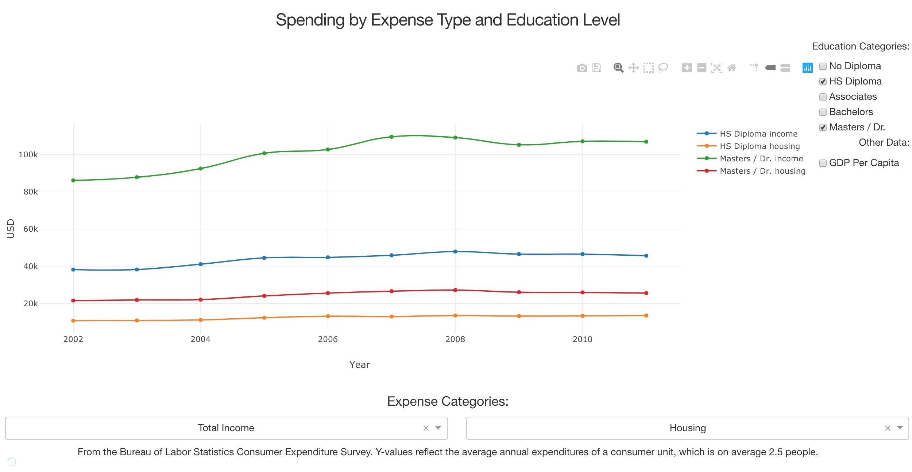
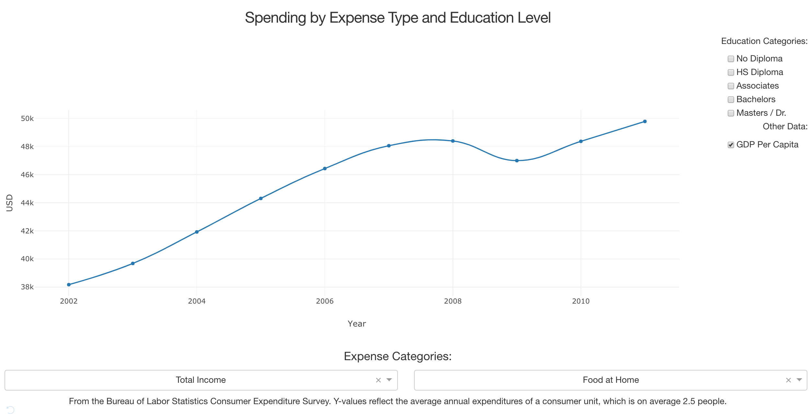

# Consumer Spending by Expense Type and Education Level

## Project Goal
To visualize how people with different levels of education spent their money between 2002 and 2012. Learn how to create interactive data visualization dashboards with Flask and Dash python modules.

## Select Income and Housing Expenses for HS and MS/DR degrees

## Select GDP Per Capita Data

## Information Detail
Expense categories include: Food at home, food away from home, healthcare, alcoholic consumption, apparel, transportation and entertainment, which are seen in our day to day lives.

Education categories include people with: no degrees, HS diploma, Associates, Bachelors, Masters/Doctoral.

## Workflow
1. Retrieved first data from the Consumer Expenditure Survey by BLS, the Bureau of Labor Statistics, using the API key, which provided a DataFrame of expense type according to consumer units of different educational degrees. Also used GDP per capita as our second datapoint from years 2002 to 2012, by downloading csv series file from World Bank Group.

2. After cleaning data, created and connected database via Flask SqlAlchemy for backend and used to seed all information into SQL database.

3. Connected the database to dashboard with Dash for frontend, which was used for front-end visualization. Created a line graph, adding interactive features by added dropdown and checkbox features via callback.
